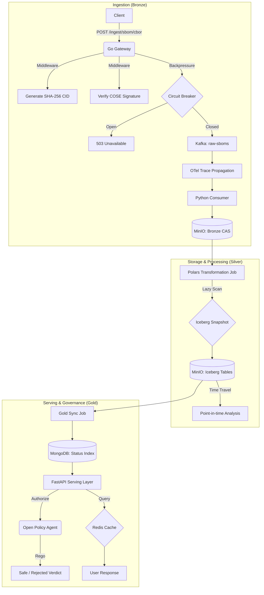

# Manifest High-Performance Ingestor: Advanced Architectural Workup

## 1. System Overview
The **Manifest High-Performance Ingestor** is an industrial-grade data pipeline designed for extreme scale and forensic integrity. It handles Software Bill of Materials (SBOM) fragments using binary formats, enforces global deduplication, ensures ACID transactions via Apache Iceberg, and provides sub-second policy-driven lookups.

### Core Performance Targets
*   **Ingestion Throughput:** 100,000+ Transactions Per Second (TPS).
*   **Binary Efficiency:** Utilization of **CBOR** for 30% smaller payloads vs JSON.
*   **Query Latency:** Sub-100ms for policy-evaluated vulnerability lookups.
*   **Deduplication:** Global **Content-Addressable Storage (CAS)** via SHA-256 CIDs.

---

## 2. Advanced System Flow Diagram (Mermaid)

---

## 3. The Advanced Medallion Layers

### Layer 1: Bronze (Go + CBOR + CAS)
*   **Format:** Uses **CBOR** (Concise Binary Object Representation) for serialized speed.
*   **Deduplication:** Every payload is hashed into a **CID** (Content Identifier). If the same binary arrives twice, we skip the storage and compute costs entirely.
*   **Resiliency:** A stateful **Circuit Breaker** monitors Kafka and backend health, failing fast to protect system resources.

### Layer 2: Silver (Polars + Iceberg)
*   **ACID Compliance:** Uses **Apache Iceberg** stubs to provide atomic writes and snapshot isolation.
*   **Time Travel:** Allows users to query exactly what the vulnerability state was at any timestamp in the past (Forensic Analysis).

### Layer 3: Gold (FastAPI + OPA + Redis)
*   **Policy Enforcement:** Integrates **Open Policy Agent (OPA)**. Every lookup is evaluated against **Rego** policies (e.g., "Block components with Critical CVEs").
*   **Observability:** Integrated **OpenTelemetry (OTel)** spans trace a single request from the Go front-door, through Kafka, into the Silver transformation, and out to the user.

---

## 4. Event Sequence & Lifecycle

| Event | Source | Destination | Action |
| :--- | :--- | :--- | :--- |
| **IngestionRequest** | External Client | Go Gateway | Receives SBOM fragment via HTTP POST. |
| **ChannelHandoff** | HTTP Handler | Buffered Channel | Decouples the HTTP response from Kafka latency. |
| **KafkaProduction** | Worker Goroutine | Kafka Broker | Asynchronously writes to the `raw-sboms` topic. |
| **BronzeArchival** | Python Consumer | MinIO (S3) | Persists raw JSON to date-partitioned storage. |
| **SilverRefinement** | Polars Job | MinIO (S3) | Joins raw data with security signatures; writes Parquet. |
| **GoldSync** | Sync Job | MongoDB | Bulk-upserts results and invalidates stale Redis cache. |
| **UserQuery** | End User | FastAPI | Performs sub-second lookup via Redis/Mongo. |

---

## 5. Technical Appendices

### Appendix A: Why Go for Ingestion?
Python’s Global Interpreter Lock (GIL) makes it difficult to handle 100k+ concurrent network connections efficiently. Go’s **Goroutines** are "green threads" that cost only 2KB of memory each, allowing a single small server to manage tens of thousands of simultaneous connections.

### Appendix B: Zero-Copy & Apache Arrow
In this system, we minimize "Serialization Tax." By targeting **Apache Arrow** formats for our internal processing, we ensure that the data structure used by the Go ingestor is identical to the one used by the Polars processing engine. This eliminates the CPU-heavy task of converting data between languages.

### Appendix C: Observability Specs
The system exports metrics to **Prometheus**:
*   `go_sbom_ingestion_total`: Ingestion rate.
*   `go_ingestion_backpressure_total`: Rate of rejected requests (indicates system saturation).
*   `vulnerability_query_total(cache_hit="true/false")`: Efficiency of the Gold serving layer.
*   `sbom_ingestion_latency_seconds`: End-to-end processing delay.
